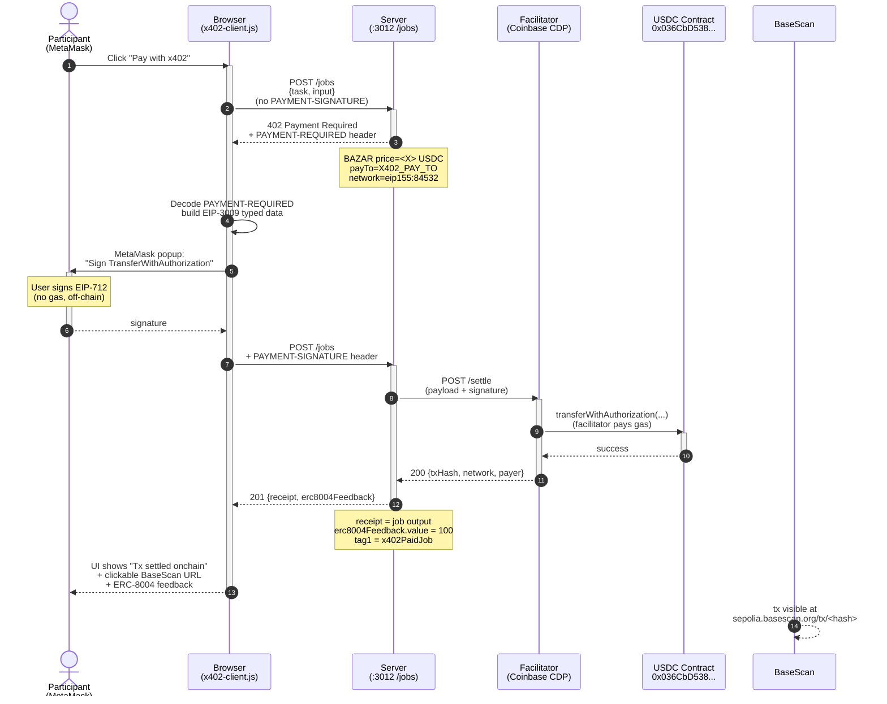

# Workshop 04 — Real x402 payments + browser wallet additions

This document is the participant guide for the `w04-update` branch.
It describes every change we made on top of Frutero's original
[`aixb-day-workshops`](https://github.com/fruteroclub/aixb-day-workshops)
repository, why we made it, and how to run the workshop from end to end.

> **TL;DR** — Frutero's workshop is great, but the stage 4 demo only shows a
> fixture payment (`x402-fixture-paid` magic string, no real USDC) and has no
> browser wallet button. Our `w04-update` branch adds:
>
> 1. A **cascade LLM reasoning** that tries Nebius → Groq → fixture, so the
>    demo never fails because a key is missing.
> 2. A **server-side live payment endpoint** (`POST /x402/pay`) that signs an
>    EIP-3009 `TransferWithAuthorization` with the workshop's buyer key and
>    settles a real testnet USDC job in Base Sepolia — no browser needed.
> 3. A **browser wallet button "Connect wallet" / "Pay with x402"** that lets
>    every participant connect their own EIP-1193 wallet (MetaMask, Coinbase
>    Wallet, Rabby, Frame) and pay for the job with their own USDC.
> 4. An **activity log panel** in the web UI so the audience can follow every
>    step of the payment (probe 402 → decoded PAYMENT-REQUIRED → signature →
>    settle → BaseScan URL → ERC-8004 feedback).

## Step 0 — Switch to the `w04-update` branch

The `main` branch of this repo is a clean fork of Frutero's repo. All the
code changes live in the `w04-update` branch.

```bash
# First time: clone and switch
git clone https://github.com/JulioMCruz/aixb-day-workshops-update.git
cd aixb-day-workshops-update
git fetch origin
git checkout -b w04-update origin/w04-update
git pull

# If you already cloned the repo:
git checkout w04-update
git pull
```

From this point on, every command assumes you are on `w04-update`.

## Step 1 — Install dependencies

```bash
cd server
npm install
```

The package list is the same as Frutero's plus a build-time esbuild call
(esbuild is a transitive dependency of `tsx`, so no new package is added
to `package.json` — only a new `build:web` script).

## Step 2 — Build the browser wallet bundle

The browser wallet button needs `public/x402-client.js`, a 412 KB ES module
that bundles viem 2.55, `@x402/evm` 2.17 and `@x402/fetch` 2.17. The
TypeScript source is in `src/web/x402-client.ts`.

```bash
npm run build:web
# → public/x402-client.js  412.6kb
# ⚡ Done in ~150ms
```

If you change `src/web/x402-client.ts`, re-run `npm run build:web` to
regenerate the bundle. The server serves it at `GET /x402-client.js`.

## Step 3 — Configure environment

Copy `.env.example` to `.env` and fill in the keys you have. The minimum
required keys to run the workshop are highlighted.

```bash
cp .env.example .env
$EDITOR .env
```

What is new in `.env.example` compared to Frutero's:

- A documented `GROQ_API_KEY` / `GROQ_MODEL` pair (Plan B LLM).
- A documented `X402_BUYER_PRIVATE_KEY` (used by `POST /x402/pay`).
- A documented `X402_PAY_TO` (the wallet that receives USDC). For a
  self-test you can set both to the same address.

If you only have Nebius, the cascade still works. If you have neither
Nebius nor Groq, the cascade falls back to a deterministic fixture
response and the demo still runs.

## Step 4 — Run the workshop (fixture mode)

```bash
npm run workshop:4
```

Open `http://localhost:3001`. The website should look like the end of W3
(the Mentor Agent panel at the top), with a new **Gate de pagos** panel
at the bottom that contains the four buttons:

- `Probar sin firma`
- `Probar con firma x402`
- `Connect wallet` (initially visible)
- `Pagar con x402` (hidden until the wallet is connected)

Click `Probar sin firma` with the **Activar pagos x402** switch OFF, and
you should see an HTTP 201 with a hardcoded demo string. That is the
default fixture behaviour.

Click `Probar sin firma` with the switch ON, and the server should reject
the request with HTTP 402 and a `PAYMENT-REQUIRED` header.

## Step 5 — Run the workshop (live mode on Base Sepolia)

Optional, but recommended. Live mode shows the audience a real testnet
settlement.

### 5.1 — Create a buyer wallet (or reuse an existing one)

```bash
npm run wallet:create
# → writes .aixb-wallet.fixture.json with { privateKey, address }
```The script uses viem's `privateKeyToAccount`, which derives the EVM
address from `keccak256(publicKey)` — the same algorithm every EVM
wallet uses. (Frutero's original script used `sha256(privateKey).slice(-40)`
which produces a wrong address. We fixed that.)

Grab the private key from the file:

```bash
node -e 'const w=require("./.aixb-wallet.fixture.json");console.log(w.privateKey)'
```

Paste it into `.env` as `X402_BUYER_PRIVATE_KEY`.

### 5.2 — Fund the wallet with ETH (gas) and USDC (payment)

Two free faucets:

- ETH: <https://www.coinbase.com/faucets/base-ethereum-sepolia-faucet>
  or <https://www.alchemy.com/faucets/base-sepolia>
- USDC: <https://faucet.circle.com/> (select Base Sepolia)

The Circle faucet also supports direct wallet connection, so you can
fund the wallet you just created with two clicks.

### 5.3 — Switch to live mode and restart the server

In `.env`, set:

```
X402_MODE=base-sepolia
X402_PAY_TO=0xYOUR_SELLER_WALLET
AGENT_PRIVATE_KEY=0xYOUR_SELLER_PRIVATE_KEY   # optional: derived address overrides X402_PAY_TO
X402_BUYER_PRIVATE_KEY=0xYOUR_BUYER_PRIVATE_KEY
```

Restart:

```bash
npm run workshop:4
```

Open `http://localhost:3001`. The **live-hint** paragraph should appear
under the toggle, and the activity log should report
`Server mode: base-sepolia-live`.

## Step 6 — Pay with the server-side flow (no browser wallet needed)

The `POST /x402/pay` endpoint runs the full flow automatically:

1. Probe `POST /jobs` without signature, expect 402.
2. Decode the `PAYMENT-REQUIRED` header.
3. Sign an EIP-3009 `TransferWithAuthorization` with `X402_BUYER_PRIVATE_KEY`.
4. Retry `POST /jobs` with the `PAYMENT-SIGNATURE` header.
5. Print the onchain transaction hash and BaseScan URL.

The simplest way to trigger it is from the web UI: flip the switch ON,
then click the **Pagar con x402** button (the third button, hidden until
the browser wallet is connected — for the server-side flow, you can also
call the endpoint with `curl`).

Or from the command line:

```bash
npm run x402:pay
```

The script uses the official `@x402/fetch` client and prints the
resulting `paymentHeader.transaction` (the onchain tx hash). Verify it
on the Base Sepolia explorer:
<https://sepolia.basescan.org/tx/0xYOUR_TX_HASH>.

## Step 7 — Pay with your own browser wallet

This is the new bit on top of Frutero. Each participant connects their
own wallet and pays with their own USDC.

1. Make sure `X402_MODE=base-sepolia` in `.env` and the server is
   running.
2. Open `http://localhost:3001` in a browser that has MetaMask (or any
   EIP-1193 wallet) installed.
3. Click **Connect wallet** in the Gate de pagos panel. Accept the
   popup.
4. If you are not on Base Sepolia (chain id `0x14a34` = 84532), the
   **Switch to Base Sepolia** button appears. Click it to add the chain
   to your wallet and switch.
5. Click **Pay with x402**. Your wallet will pop up asking to sign an
   EIP-3009 `TransferWithAuthorization` for the job price.
6. The activity log shows the onchain transaction hash and a clickable
   BaseScan URL.

Each participant signs with their own key, so the workshop can run with
50 students without sharing a private key. Each student needs:

- A browser with MetaMask (or any EIP-1193 wallet) installed
- A small amount of Base Sepolia ETH for gas
- A small amount of Base Sepolia USDC for the job price

The facilitator wallet (`X402_PAY_TO`) receives USDC for every paid job.

#### Sequence diagram — x402 real pay flow on Base Sepolia

The flow that happens when the participant clicks "Pay with x402":



Each numbered step corresponds to a `logEvent()` entry in the activity
panel. The student watches the browser, the facilitator, and the USDC
contract interact in real time. Note that **the user only signs once**
(EIP-3009, no gas); **the facilitator pays gas** when it submits the
onchain transfer.

## Step 8 — W4 BONUS: register your agent on ERC-8004 (onchain identity)

ERC-8004 is the onchain agent identity standard. The
`IdentityRegistry` on Base Sepolia is an ERC-721 NFT contract:
calling `register(string agentURI)` mints an NFT to your wallet and
stores the `agentURI` (a self-describing JSON document about your agent).
This is what other agents will use to look you up and verify what you
can do.

> Identity is the layer that lets a buyer know *who* they paid. The
> x402 payment proves *that* a payment happened; the ERC-8004
> registration proves *which* agent they paid. They are complementary
> rails, not competitors.

The workshop UI exposes a 2-button flow on top of the wallet panel:

- **Check 8004 registration** — calls `GET /agents/<address>` and
  reads the `IdentityRegistry` onchain. If your wallet already owns
  an agent NFT, you'll see `agentId` and a clickable BaseScan link.
- **Register on 8004** — builds a `data:application/json;base64,...`
  `agentURI` that points to your agent's metadata (name, description,
  services, image, x402 support), encodes the call data for
  `register(string)`, and asks your wallet to send the transaction.
  You sign in MetaMask / Coinbase Wallet / Rabby and pay gas from
  your own ETH balance.

- **Register seller agent (server-side)** — the workshop's seller
  wallet (`AGENT_PRIVATE_KEY`) signs and sends the same `register()`
  tx. The NFT owner is the seller, which matches `X402_PAY_TO`. This
  is the canonical agent identity for the workshop demo, separate
  from the user wallet. No MetaMask needed: the server does it.
  Requires `AGENT_PRIVATE_KEY` to be set in `.env` and the wallet
  to have ETH for gas. Idempotent: a second click returns the same
  `agentId` without sending a new tx.

### Two flows, two owners

ERC-8004 design: the owner of the NFT is whoever pays gas. The two
buttons reflect the two distinct identity questions:

| Button | Who pays gas | NFT owner | Use case |
|--------|--------------|-----------|----------|
| Register on 8004 | User's MetaMask | User's wallet | "I, as a user, am also an agent" |
| Register seller agent (server-side) | Seller wallet (AGENT_PRIVATE_KEY) | Seller wallet (X402_PAY_TO) | "This is the canonical agent that receives x402" |

For the workshop demo, the second flow is the one that demonstrates
the separation between **user** (pays with EIP-3009) and **agent**
(has its own onchain identity). User reputation is ephemeral; agent
reputation persists in the ERC-8004 `ReputationRegistry`.

### 8.1 — What the server builds for you

The endpoint `GET /agents/<address>` returns either:

- `registered: true` with `agentId` (when the agent NFT exists and was
  minted within the last ~2 days; older agents show as registered but
  `agentId` may be null — see the BaseScan link to recover it), or
- `registered: false` with a pre-built `selfRegistrationURI` — a
  base64-encoded JSON document following the `eip-8004#registration-v1`
  schema that you can register as-is.

The `selfRegistrationURI` is generated server-side because the
registration JSON has to include your wallet's address (the agent's
owner) and the workshop server's endpoints (web, API, x402). You don't
need IPFS or any external hosting: the URI is inline.

Example response for an unregistered wallet:

```json
{
  "ok": true,
  "registered": false,
  "address": "0x499D377eF114cC1BF7798cECBB38412701400daF",
  "agentId": null,
  "baseScanToken": "https://sepolia.basescan.org/token/0x8004A818BFB912233c491871b3d84c89A494BD9e?a=0x499D377eF114cC1BF7798cECBB38412701400daF",
  "selfRegistrationURI": "data:application/json;base64,eyJ0eXBlI..."
}
```

You can also call this from the command line:

```bash
curl -sS http://localhost:3012/agents/0xYOUR_ADDRESS | jq .
curl -sS http://localhost:3012/agents/registry-info | jq .
```

### 8.2 — Register your wallet onchain

1. Open the workshop UI at <http://localhost:3012/>.
2. Make sure the **Activar pagos x402** switch is ON and your wallet is
   connected on Base Sepolia.
3. Scroll down to the **ERC-8004 identity** section.
4. Click **Check 8004 registration**.
5. If you see `NOT REGISTERED`, click **Register on 8004**.
6. Your wallet (MetaMask / Coinbase Wallet / Rabby) will pop up asking
   you to confirm a transaction to
   `0x8004A818BFB912233c491871b3d84c89A494BD9e` (the
   `IdentityRegistry`). The call data encodes `register(string)` with
   the `agentURI` from step 8.1.
7. Confirm the transaction. It costs a small amount of Base Sepolia
   ETH for gas.
8. Wait ~10 seconds. The UI polls `GET /agents/<address>` every 2s for
   up to 60s. When the agent NFT is visible, you'll see `agentId` and
   a clickable BaseScan link to the token.
9. Re-run **Check 8004 registration** any time to confirm.

The activity log will show 3 events:

- `ERC-8004 feedback: value=100 tag1=x402PaidJob ...` (from the x402
  paid job — Step 7 left this in your log)
- `Wallet conectada: 0x1234...`
- `Call data encodeado (N bytes)` — encoded register call data
- `Tx enviada: 0xabc...` — with a clickable `ver tx ↗` link to BaseScan
- `¡Agent registrado! agentId = N` — with a clickable `ver NFT ↗` link

> **End-to-end verified (2026-07-09 10:36 UTC):** the facilitator's
> `X402_BUYER_PRIVATE_KEY` wallet (`0x4a8FFDA35Fd4463E881a0E69215B547FE8EFCEd4`)
> successfully registered on the Base Sepolia `IdentityRegistry`. The
> resulting `agentId` is `7893`, the tx hash is
> `0xe476dafc9b7c7ec009891b8be8370aac501c6eef21137853308554da423ea3ab`,
> and the lookup endpoint recovered it in 0.45s. Gas used: 799556.
> See the live token at
> <https://sepolia.basescan.org/token/0x8004A818BFB912233c491871b3d84c89A494BD9e?a=0x4a8FFDA35Fd4463E881a0E69215B547FE8EFCEd4>.

#### Sequence diagram — ERC-8004 register flow

The flow your wallet will go through when you click "Register on 8004":

```mermaid
sequenceDiagram
    autonumber
    actor U as Participant<br/>(MetaMask)
    participant B as Browser<br/>(x402-client.js)
    participant S as Server<br/>(:3012)
    participant R as Base Sepolia<br/>IdentityRegistry<br/>0x8004A818...
    participant BS as BaseScan

    U->>B: Click "Register on 8004"
    activate B
    B->>S: GET /agents/<address>
    activate S
    S->>R: balanceOf(address) [view]
    R-->>S: 0 (not registered)
    S->>S: buildSelfRegistrationURI()
    Note over S: inline data:application/json;base64,...
    S-->>B: 200 {registered:false, selfRegistrationURI}
    deactivate S

    B->>B: viem.encodeFunctionData<br/>(register, [agentURI])
    B->>U: MetaMask popup:<br/>"Confirm transaction"
    activate U
    Note over U: User clicks Confirm<br/>(pays gas from own ETH)
    U->>R: eth_sendTransaction<br/>(to=registry, data=callData)
    deactivate U
    activate R
    R->>R: register(agentURI)<br/>mint NFT to user
    R-->>BS: tx mined
    R-->>B: txHash
    deactivate R

    loop poll every 2s, max 30 attempts
      B->>S: GET /agents/<address>
      S->>R: balanceOf(address)
      R-->>S: 1
      S->>R: getLogs(Registered, owner=address)
      R-->>S: [Registered event]
      S-->>B: 200 {registered:true, agentId:#N}
    end

    B-->>U: UI shows "agentId = #N"<br/>+ clickable BaseScan links
    deactivate B
```

Each numbered step corresponds to a `logEvent()` entry in the activity
panel on the workshop UI. The student watches the steps happen in
real time as the wallet and the blockchain respond.

### 8.3 — Code: how it works

The whole flow is ~200 lines of code across 4 files:

- `server/src/integrations/erc8004.ts` — `lookupAgent()` reads
  `balanceOf(address)` on the registry, then walks back the `Registered`
  event log in 2000-block chunks to recover `agentId`.
  `buildSelfRegistrationURI()` builds the registration JSON inline
  (no IPFS). `encodeRegisterCallData()` returns the hex call data for
  the browser wallet.
- `server/src/routes/jobs.ts` — 2 new endpoints:
  - `GET /agents/registry-info` — static helper with the contract
    address, chainId, and BaseScan URL.
  - `GET /agents/:address` — onchain lookup; pre-builds
    `selfRegistrationURI` when the wallet is not yet registered.
- `server/src/web/x402-client.ts` — 2 new browser methods:
  - `lookupAgent8004(address)` — fetches `/agents/:address`.
  - `registerAgent8004()` — asks the server for the `agentURI`,
    encodes the call data locally with `viem.encodeFunctionData()`,
    and submits via `window.ethereum.request({ method:
    'eth_sendTransaction', ... })`. Then polls the server for up to
    60s to surface the new `agentId`.
- `server/src/routes/web.ts` — 2 new buttons in a new
  `#erc8004-panel` section of the wallet panel. Visible only when the
  wallet is connected AND the x402 payment gate is ON. The Register
  button is hidden when the wallet is already registered.

### 8.4 — When to use this in your own projects

The pattern is:

- **Look up the agent** before you call a paid service. If the
  provider is registered, you have an `agentId` to put in your
  payment receipt / audit log.
- **Register your own agent** the first time you call any x402
  service. The registration is permanent and one-time per wallet.
- **Use the same `agentURI` shape** as the workshop server
  (`eip-8004#registration-v1` with `services[]` and `x402Support:
  true`). The `agentRegistry` field in `registrations[]` should be
  `eip155:84532:0x8004A818BFB912233c491871b3d84c89A494BD9e` on Base
  Sepolia (use the equivalent for your target chain).
- **Don't rely on `tokenOfOwnerByIndex`** — the Base Sepolia
  `IdentityRegistry` does not implement it. Always use the
  `Registered` event log to recover `agentId` from an owner address.

The ERC-8004 contract addresses on testnet (verified July 2026):

| Network | Chain ID | IdentityRegistry |
| --- | --- | --- |
| Base Sepolia | 84532 | `0x8004A818BFB912233c491871b3d84c89A494BD9e` |
| Ethereum Sepolia | 11155111 | (see agent0lab/subgraph config) |

## Summary of code changes

All the changes below live in the `w04-update` branch, in the `server/`
directory. See `git diff main..w04-update -- server` for the full diff.

### New files

- `server/public/x402-client.js` — esbuild bundle of the browser wallet
  client (viem + x402/evm + x402/fetch). Served at `GET /x402-client.js`.
- `server/src/web/x402-client.ts` — TypeScript source of the browser
  wallet client. Exports `window.aixbWallet` with 9 methods
  (`isConnected`, `getAddress`, `getChainId`, `connectWallet`,
  `disconnectWallet`, `switchToBaseSepolia`, `payWithX402`,
  `onAccountChanged`, `onChainChanged`).
- `server/src/routes/x402-pay.ts` — server-side live payment endpoint
  that runs the full probe → sign → settle flow and returns a 17-entry
  activity log plus the onchain transaction hash.

### Modified files

- `server/src/integrations/nebius.ts` — replaced `callNebius()` with
  `callLLM()` cascade that tries Nebius → Groq → fixture in order.
- `server/scripts/create-wallet.ts` — fixed the EVM address derivation
  bug (`sha256(privateKey).slice(-40)` → `keccak256(publicKey)` via
  viem's `privateKeyToAccount`).
- `server/src/app.ts` — added `GET /x402-client.js` route.
- `server/src/routes/web.ts` — added four wallet buttons (Connect wallet,
  Pay with x402, Switch to Base Sepolia, Disconnect), the activity log
  panel with color-coded entries, and the wallet-info paragraph.
- `server/src/types.ts` — added the `paymentsEnabled` / `mode` typing
  for the payment-mode endpoint.
- `server/.env.example` — documented `GROQ_API_KEY` / `GROQ_MODEL`
  (Plan B) and `X402_BUYER_PRIVATE_KEY` / `X402_PAY_TO`.
- `server/.gitignore` — added `.aixb-wallet.fixture.json` and
  `.env.backup-*` patterns.
- `server/package.json` — added `npm run build:web` script.
- `server/README.md` — added a section pointing to this `PASOS.md` and
  summarising the live settlement flow.

### What we deliberately did NOT change

- `server/src/integrations/x402.ts` — the @x402/hono middleware and
  verifier work as-is. The browser-signed `PAYMENT-SIGNATURE` is
  accepted by the same middleware, with no changes needed.
- `server/src/integrations/erc8004.ts` — the ERC-8004 identity card and
  the `erc8004Feedback` in paid job responses are unchanged.
- `server/src/integrations/github.ts`, `brain.ts`, `agent.ts`,
  `mentor.ts`, `mentor-agent.ts` — untouched.
- The whole `workshops/` directory except for this `PASOS.md` file.
- The whole `README.md` at the root of the repo.

## Why this approach

We chose to keep the server-side flow (`POST /x402/pay`) AND the
browser-side flow (`Connect wallet` / `Pay with x402`) because they
serve different audiences:

- The **server-side flow** is what the facilitator uses during the demo
  to show the audience a real settlement. It works even if the
  facilitator's browser has no wallet. The 17-entry activity log is the
  narrative for the audience.
- The **browser-side flow** is what each student runs on their own
  laptop. It teaches them that the buyer signs the payment with their
  own key — no one else's private key ever touches their machine. It
  also scales to 50 students with no per-student configuration.

Frutero's original `POST /jobs` accepts a `PAYMENT-SIGNATURE` header
with the magic string `x402-fixture-paid` for the no-fund demo. The
real settlement mode is the same middleware, but with a real signed
header. Our additions are entirely additive — they do not change any
of Frutero's existing endpoints, only add new ones (the `POST /x402/pay`
and the `GET /x402-client.js` routes, plus the four buttons in the
web UI).

## Cleanup after the workshop

- Delete `.aixb-wallet.fixture.json` (it still has whatever ETH and USDC
  you sent to the test wallet).
- Remove `X402_BUYER_PRIVATE_KEY` from `server/.env` if the file is
  shared.
- Switch `X402_MODE=fixture` (or unset it) to fall back to the no-fund
  demo.
- Optionally send the remaining testnet funds to a burn address.

## References

- Official Frutero workshop: <https://github.com/fruteroclub/aixb-day-workshops>
- x402 seller quickstart: <https://docs.x402.org/getting-started/quickstart-for-sellers>
- x402 MCP/agent flow: <https://docs.x402.org/guides/mcp-server-with-x402>
- ERC-8004: <https://eips.ethereum.org/EIPS/eip-8004>
- Circle USDC Faucet: <https://faucet.circle.com/>
- Coinbase Base Sepolia Faucet: <https://www.coinbase.com/faucets/base-ethereum-sepolia-faucet>
- Alchemy Base Sepolia Faucet: <https://www.alchemy.com/factions/base-sepolia>
- Base Sepolia Explorer: <https://sepolia.basescan.org/>
