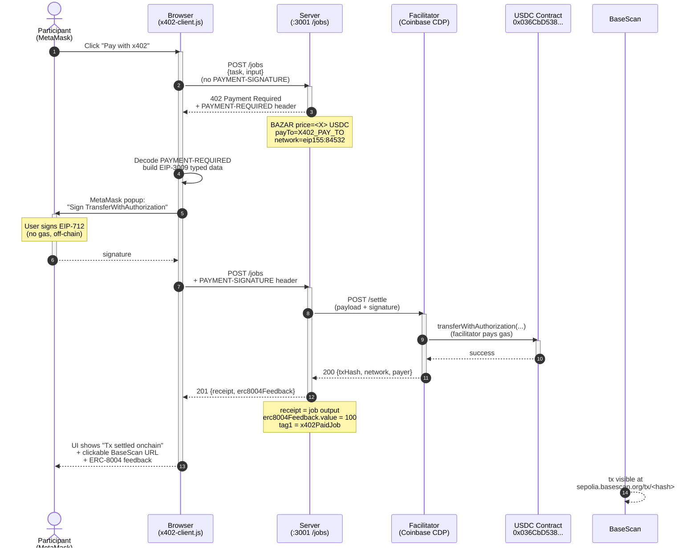

# Workshop 04 — Real x402 payments + browser wallet additions

This document is the participant guide for the `w04-update` branch.
It describes every change we made on top of Frutero's original
[`aixb-day-workshops`](https://github.com/fruteroclub/aixb-day-workshops)
repository, why we made it, and how to run the workshop from end to end.

> **TL;DR** — Frutero's workshop is great, but the stage 4 demo only shows a
> fixture payment (`x402-fixture-paid` magic string, no real USDC) and has no
> browser wallet button. Our `w04-update` branch adds:
>
> 1. A **cascade LLM reasoning** that tries Nebius and falls back to a local
>    fixture, so the demo never fails because a key is missing.
> 2. A **server-side live payment endpoint** (`POST /x402/pay`) that signs an
>    EIP-3009 `TransferWithAuthorization` with the workshop's buyer key and
>    settles a real testnet USDC job in Base Sepolia — no browser needed.
> 3. A **browser wallet button "Connect wallet" / "Pay with x402"** that lets
>    every participant connect their own EIP-1193 wallet (MetaMask, Coinbase
>    Wallet, Rabby, Frame) and pay for the job with their own USDC.
> 4. An **activity log panel** in the web UI so the audience can follow every
>    step of the payment (probe 402 → decoded PAYMENT-REQUIRED → signature →
>    settle → BaseScan URL → ERC-8004 feedback).

## Code map — one new file per topic

Frutero's original code is respected: every new capability lives in a
**new file**, so during the demo you can open one file and show one
topic. Links point to the `w04-update` branch:

| To show... | Open | What to look at |
|---|---|---|
| A REAL x402 payment from the browser | [`server/src/web/x402-client.ts`](https://github.com/JulioMCruz/aixb-day-workshops-update/blob/w04-update/server/src/web/x402-client.ts) | `payWithX402()`: probe 402 → decode the machine-readable invoice → sign EIP-3009 with MetaMask (no gas) → facilitator settles onchain → BaseScan link |
| The same x402 payment, server-side (no browser wallet) | [`server/src/routes/x402-pay.ts`](https://github.com/JulioMCruz/aixb-day-workshops-update/blob/w04-update/server/src/routes/x402-pay.ts) | `POST /x402/pay`: signs with `X402_BUYER_PRIVATE_KEY` and returns the full step log |
| How the server CHARGES with x402 (the 402 gate) | [`server/src/integrations/x402-live.ts`](https://github.com/JulioMCruz/aixb-day-workshops-update/blob/w04-update/server/src/integrations/x402-live.ts) | `createLiveX402Middleware()`: the official @x402/hono middleware answering 402 and settling through the facilitator |
| How the agent wallet registers its ERC-8004 identity | [`server/src/integrations/erc8004-onchain.ts`](https://github.com/JulioMCruz/aixb-day-workshops-update/blob/w04-update/server/src/integrations/erc8004-onchain.ts) | `serverRegisterAgent()`: sign `register(agentURI)` with `AGENT_PRIVATE_KEY`, mint the identity NFT, recover the `agentId` from the event. `lookupAgent()`: read the registry |
| The identity HTTP endpoints | [`server/src/routes/agents.ts`](https://github.com/JulioMCruz/aixb-day-workshops-update/blob/w04-update/server/src/routes/agents.ts) | `GET /agents/:address` (lookup) and `POST /agents/register-server` (register + step log) |
| The LLM fallback that keeps the demo alive | [`server/src/integrations/llm.ts`](https://github.com/JulioMCruz/aixb-day-workshops-update/blob/w04-update/server/src/integrations/llm.ts) | `callLLM()` cascade: Nebius if configured, local fixture otherwise |

Original files keep Frutero's code. The wiring changes are small and
the relevant ones carry a `// w04-update` comment: `app.ts` (registers
the new routes), `jobs.ts` (applies the live gate when the switch is
ON), `erc8004.ts` (real registry tag), `nebius.ts` (delegates to the
cascade), `x402.ts` (derives the seller address from
`AGENT_PRIVATE_KEY`), `web.ts` (the Gate de pagos UI panel and
activity log).

## Step 0 — Switch to the `w04-update` branch

The `main` branch of this repo is a clean fork of Frutero's repo. All the
code changes live in the `w04-update` branch.

```bash
# First time: clone and switch
git clone https://github.com/JulioMCruz/aixb-day-workshops-update.git
cd aixb-day-workshops-update
git fetch origin
git checkout -b w04-update origin/w04-update
git pull

# If you already cloned the repo:
git checkout w04-update
git pull
```

From this point on, every command assumes you are on `w04-update`.

## Step 1 — Install dependencies

```bash
cd server
npm install
```

The package list is the same as Frutero's plus a build-time esbuild call
(esbuild is a transitive dependency of `tsx`, so no new package is added
to `package.json` — only a new `build:web` script).

## Step 2 — Build the browser wallet bundle

The browser wallet button needs `public/x402-client.js`, a 412 KB ES module
that bundles viem 2.55, `@x402/evm` 2.17 and `@x402/fetch` 2.17. The
TypeScript source is in `src/web/x402-client.ts`.

```bash
npm run build:web
# → public/x402-client.js  412.6kb
# ⚡ Done in ~150ms
```

If you change `src/web/x402-client.ts`, re-run `npm run build:web` to
regenerate the bundle. The server serves it at `GET /x402-client.js`.

## Step 3 — Configure environment

Copy `.env.example` to `.env` and fill in the keys you have. The minimum
required keys to run the workshop are highlighted.

```bash
cp .env.example .env
$EDITOR .env
```

What is new in `.env.example` compared to Frutero's:

- A documented `AGENT_PRIVATE_KEY` — the private key of the **agent
  (seller) wallet**. The server signs the ERC-8004 `register()` tx
  with it (Step 8) and derives its address automatically.
- A documented `X402_PAY_TO` — the **agent wallet address**: it
  receives the USDC of every paid job AND it is the address that gets
  the ERC-8004 identity NFT. Payments and identity belong to the same
  wallet. If `AGENT_PRIVATE_KEY` is set, the server derives
  `X402_PAY_TO` from it, so they always match.
- A documented `X402_BUYER_PRIVATE_KEY` — the buyer wallet used by
  `POST /x402/pay` and `npm run x402:pay` (the wallet that PAYS; keep
  it separate from the agent wallet).

For the LLM, only `NEBIUS_API_KEY` matters: with it the reasoning is
live, without it the cascade falls back to a deterministic fixture
response and the demo still runs. No other LLM key is needed.

## Step 4 — Run the workshop (fixture mode)

```bash
npm run workshop:4
```

Open `http://localhost:3001`. The website should look like the end of W3
(the Mentor Agent panel at the top), with a new **Gate de pagos** panel
at the bottom that contains the four buttons:

- `Probar sin firma`
- `Probar con firma x402` (fixture mode)
- `Pagar desde CLI` (live mode)
- `Connect wallet` / `Pay with x402` (live mode; they appear when the
  x402 switch is ON)

Click `Probar sin firma` with the **Activar pagos x402** switch OFF, and
you should see an HTTP 201 with a hardcoded demo string. That is the
default fixture behaviour.

Click `Probar sin firma` with the switch ON, and the server should reject
the request with HTTP 402 and a `PAYMENT-REQUIRED` header.

## Step 5 — Run the workshop (live mode on Base Sepolia)

Optional, but recommended. Live mode shows the audience a real testnet
settlement.

### 5.1 — Create a buyer wallet (or reuse an existing one)

```bash
npm run wallet:create
# → writes .aixb-wallet.fixture.json with { privateKey, address }
```

The script uses viem's `privateKeyToAccount`, which derives the EVM
address from `keccak256(publicKey)` — the same algorithm every EVM
wallet uses. (Frutero's original script used `sha256(privateKey).slice(-40)`
which produces a wrong address. We fixed that.)

Grab the private key from the file:

```bash
node -e 'const w=require("./.aixb-wallet.fixture.json");console.log(w.privateKey)'
```

Paste it into `.env` as `X402_BUYER_PRIVATE_KEY`.

### 5.2 — Fund the wallet with ETH (gas) and USDC (payment)

Two free faucets:

- ETH: <https://www.coinbase.com/faucets/base-ethereum-sepolia-faucet>
  or <https://www.alchemy.com/faucets/base-sepolia>
- USDC: <https://faucet.circle.com/> (select Base Sepolia)

The Circle faucet also supports direct wallet connection, so you can
fund the wallet you just created with two clicks.

### 5.3 — Switch to live mode and restart the server

In `.env`, set:

```
X402_MODE=base-sepolia
AGENT_PRIVATE_KEY=0xAGENT_WALLET_PRIVATE_KEY   # agent (seller) wallet: signs the ERC-8004 register() tx
X402_PAY_TO=0xAGENT_WALLET_ADDRESS             # that wallet's address: receives USDC and holds the ERC-8004 identity
X402_BUYER_PRIVATE_KEY=0xBUYER_PRIVATE_KEY     # buyer wallet: pays the jobs (keep it separate from the agent)
```

`X402_PAY_TO` must be the address of the agent that will get the
ERC-8004 identity in Step 8: payments and identity belong to the same
wallet. If `AGENT_PRIVATE_KEY` is set, the server derives the address
from it automatically, so `X402_PAY_TO` can be omitted.

Restart:

```bash
npm run workshop:4
```

Open `http://localhost:3001`. The **live-hint** paragraph should appear
under the toggle, and the activity log should report
`Server mode: base-sepolia-live`.

## Step 6 — Pay with the server-side flow (no browser wallet needed)

The `POST /x402/pay` endpoint runs the full flow automatically:

1. Probe `POST /jobs` without signature, expect 402.
2. Decode the `PAYMENT-REQUIRED` header.
3. Sign an EIP-3009 `TransferWithAuthorization` with `X402_BUYER_PRIVATE_KEY`.
4. Retry `POST /jobs` with the `PAYMENT-SIGNATURE` header.
5. Print the onchain transaction hash and BaseScan URL.

The simplest way to trigger it is from the web UI: flip the switch ON,
then click the **Pagar con x402** button (the third button, hidden until
the browser wallet is connected — for the server-side flow, you can also
call the endpoint with `curl`).

Or from the command line:

```bash
npm run x402:pay
```

The script uses the official `@x402/fetch` client and prints the
resulting `paymentHeader.transaction` (the onchain tx hash). Verify it
on the Base Sepolia explorer:
<https://sepolia.basescan.org/tx/0xYOUR_TX_HASH>.

## Step 7 — Pay with your own browser wallet

This is the new bit on top of Frutero. Each participant connects their
own wallet and pays with their own USDC.

1. Make sure `X402_MODE=base-sepolia` in `.env` and the server is
   running.
2. Open `http://localhost:3001` in a browser that has MetaMask (or any
   EIP-1193 wallet) installed.
3. Click **Connect wallet** in the Gate de pagos panel. Accept the
   popup.
4. If you are not on Base Sepolia (chain id `0x14a34` = 84532), the
   **Switch to Base Sepolia** button appears. Click it to add the chain
   to your wallet and switch.
5. Click **Pay with x402**. Your wallet will pop up asking to sign an
   EIP-3009 `TransferWithAuthorization` for the job price.
6. The activity log shows the onchain transaction hash and a clickable
   BaseScan URL.

Each participant signs with their own key, so the workshop can run with
50 students without sharing a private key. Each student needs:

- A browser with MetaMask (or any EIP-1193 wallet) installed
- A small amount of Base Sepolia ETH for gas
- A small amount of Base Sepolia USDC for the job price

The agent wallet (`X402_PAY_TO`) receives USDC for every paid job — the
same wallet that holds the ERC-8004 identity from Step 8.

#### Sequence diagram — x402 real pay flow on Base Sepolia

The flow that happens when the participant clicks "Pay with x402":



Each numbered step corresponds to a `logEvent()` entry in the activity
panel. The student watches the browser, the facilitator, and the USDC
contract interact in real time. Note that **the user only signs once**
(EIP-3009, no gas); **the facilitator pays gas** when it submits the
onchain transfer.

## Step 8 — W4 BONUS: register your agent on ERC-8004 (onchain identity)

ERC-8004 is the onchain agent identity standard. The
`IdentityRegistry` on Base Sepolia is an ERC-721 NFT contract:
calling `register(string agentURI)` mints an NFT to your wallet and
stores the `agentURI` (a self-describing JSON document about your agent).
This is what other agents will use to look you up and verify what you
can do.

> Identity is the layer that lets a buyer know *who* they paid. The
> x402 payment proves *that* a payment happened; the ERC-8004
> registration proves *which* agent they paid. They are complementary
> rails, not competitors.

The workshop UI exposes a 1-button flow for the seller agent:

- **Check 8004 registration** — calls `GET /agents/<address>` and
  reads the `IdentityRegistry` onchain. If the seller wallet already
  owns an agent NFT, you'll see `agentId` and a clickable BaseScan link.
- **Register seller agent (server-side)** — the workshop's seller
  wallet (`AGENT_PRIVATE_KEY`) signs and sends the `register()`
  tx. The NFT owner is the seller, which matches `X402_PAY_TO`. This
  is the canonical agent identity for the workshop demo. No MetaMask
  needed: the server does it. Requires `AGENT_PRIVATE_KEY` to be set
  in `.env` and the wallet to have ETH for gas. Idempotent: a second
  click returns the same `agentId` without sending a new tx.

### Why server-side, not browser-side

ERC-8004 design: the owner of the NFT is whoever pays gas. The
server-side flow reflects the canonical identity question:

| Flow | Who pays gas | NFT owner | Use case |
|------|--------------|-----------|----------|
| **Server-side** (the workshop default) | Seller wallet (AGENT_PRIVATE_KEY) | Seller wallet (X402_PAY_TO) | "This is the canonical agent that receives x402" |

For the workshop demo, the server-side flow is the one that
demonstrates the separation between **user** (pays with EIP-3009)
and **agent** (has its own onchain identity). User reputation is
ephemeral; agent reputation persists in the ERC-8004
`ReputationRegistry`.

(An earlier version of the UI had a browser-side button that signed
the `register()` tx with the user's MetaMask. It was removed because
it registered the user wallet as the agent owner, which conceptually
breaks the user/agent separation that ERC-8004 is designed to support.)

### 8.1 — What the server builds for you

The endpoint `GET /agents/<address>` returns either:

- `registered: true` with `agentId` (when the agent NFT exists and was
  minted within the last ~2 days; older agents show as registered but
  `agentId` may be null — see the BaseScan link to recover it), or
- `registered: false` with a pre-built `selfRegistrationURI` — a
  base64-encoded JSON document following the `eip-8004#registration-v1`
  schema that you can register as-is.

The `selfRegistrationURI` is generated server-side because the
registration JSON has to include your wallet's address (the agent's
owner) and the workshop server's endpoints (web, API, x402). You don't
need IPFS or any external hosting: the URI is inline.

Example response for an unregistered wallet:

```json
{
  "ok": true,
  "registered": false,
  "address": "0x499D377eF114cC1BF7798cECBB38412701400daF",
  "agentId": null,
  "baseScanToken": "https://sepolia.basescan.org/token/0x8004A818BFB912233c491871b3d84c89A494BD9e?a=0x499D377eF114cC1BF7798cECBB38412701400daF",
  "selfRegistrationURI": "data:application/json;base64,eyJ0eXBlI..."
}
```

You can also call this from the command line:

```bash
curl -sS http://localhost:3001/agents/0xYOUR_ADDRESS | jq .
curl -sS http://localhost:3001/agents/registry-info | jq .
```

### 8.2 — Register the seller agent onchain

1. Open the workshop UI at <http://localhost:3001/>.
2. Make sure the **Activar pagos x402** switch is ON.
3. Scroll down to the **ERC-8004 identity** section.
4. Click **Check 8004 registration** to read the seller wallet's
   current onchain state. If it shows `NOT REGISTERED`, continue.
5. Click **Register seller agent (server-side)**. The server signs
   the `register()` tx with `AGENT_PRIVATE_KEY` and sends it from
   the seller wallet to the `IdentityRegistry` at
   `0x8004A818BFB912233c491871b3d84c89A494BD9e`. The seller wallet
   pays gas from its own ETH balance.
6. Wait ~10 seconds. The server returns the `agentId` and `txHash`.
7. The UI shows a clickable BaseScan link to the new agent NFT.
8. Re-run **Check 8004 registration** any time to confirm. The
   button is idempotent: a second click returns the same `agentId`
   without sending a new tx.

The server returns its step log in the response and the UI replays it
in the activity panel, so the participant can follow the whole flow:

- `Wallet del agente (seller): 0x... El server firma con AGENT_PRIVATE_KEY, tu MetaMask no participa.`
- `Paso 1/4: consultando el IdentityRegistry en Base Sepolia. ¿Esta wallet ya tiene identidad de agente?`
- `Paso 2/4: agentURI listo, un JSON con nombre, endpoints y soporte x402 del agente, embebido como data: URI`
- `Paso 3/4: enviando la tx register(agentURI) al IdentityRegistry...` (clickable BaseScan tx link)
- `Confirmada en el bloque N. Costo real: 799556 gas, 0.0008 ETH de testnet.`
- `Paso 4/4: agentId asignado: #N. El agente ya tiene su NFT de identidad ERC-8004...` (clickable NFT link)

On a second click, step 1 short-circuits: `Ya estaba registrada como
agentId #N. El registro es idempotente: no se envía otra tx y no se
gasta gas.`

> **End-to-end verified (2026-07-09 10:36 UTC):** the facilitator's
> `X402_BUYER_PRIVATE_KEY` wallet (`0x4a8FFDA35Fd4463E881a0E69215B547FE8EFCEd4`)
> successfully registered on the Base Sepolia `IdentityRegistry`. The
> resulting `agentId` is `7893`, the tx hash is
> `0xe476dafc9b7c7ec009891b8be8370aac501c6eef21137853308554da423ea3ab`,
> and the lookup endpoint recovered it in 0.45s. Gas used: 799556.
> See the live token at
> <https://sepolia.basescan.org/token/0x8004A818BFB912233c491871b3d84c89A494BD9e?a=0x4a8FFDA35Fd4463E881a0E69215B547FE8EFCEd4>.

#### Sequence diagram — ERC-8004 register flow (server-side)

The flow when the participant clicks "Register seller agent (server-side)":

```mermaid
sequenceDiagram
    autonumber
    actor U as Participant<br/>(browser)
    participant B as Browser
    participant S as Server<br/>(:3001)
    participant W as Seller wallet<br/>(AGENT_PRIVATE_KEY)
    participant R as Base Sepolia<br/>IdentityRegistry<br/>0x8004A818...
    participant BS as BaseScan

    U->>B: Click "Register seller agent<br/>(server-side)"
    activate B
    B->>S: POST /agents/register-server
    activate S
    S->>W: privateKeyToAccount(pk)
    W-->>S: account.address
    S->>S: lookupAgent(address)
    S->>R: balanceOf(address) [view]
    R-->>S: 0 (not registered)
    S->>S: buildSelfRegistrationURI()
    Note over S: inline data:application/json;base64,...
    S->>W: createWalletClient.writeContract(<br/>register, [agentURI])
    activate W
    Note over W: Seller signs tx<br/>(pays gas from own ETH)
    W->>R: register(agentURI)
    deactivate W
    activate R
    R->>R: mint NFT to seller
    R-->>BS: tx mined
    R-->>W: txHash
    deactivate R
    S->>S: parse Registered event<br/>extract agentId
    S-->>B: 200 {agentId, txHash, owner, baseScanToken}
    deactivate S
    B-->>U: UI shows "agentId = #N"<br/>+ clickable BaseScan links
    deactivate B
```

Each numbered step corresponds to a `logEvent()` entry in the activity
panel on the workshop UI. The student watches the steps happen in
real time as the server signs and the blockchain responds.

Key difference from the previous (removed) browser-side flow: **no
MetaMask popup**. The seller wallet (`AGENT_PRIVATE_KEY`) signs the
tx on the server. The NFT owner is the seller (which matches
`X402_PAY_TO`), not the user.

### 8.3 — Code: how it works

The whole flow is ~200 lines of code across 4 files:

- `server/src/integrations/erc8004-onchain.ts` — `lookupAgent()` reads
  `balanceOf(address)` on the registry, then walks back the `Registered`
  event log in 2000-block chunks to recover `agentId`.
  `buildSelfRegistrationURI()` builds the registration JSON inline
  (no IPFS). `serverRegisterAgent()` signs and sends the `register()`
  tx with `AGENT_PRIVATE_KEY` and narrates each step for the UI log.
- `server/src/routes/agents.ts` — 3 endpoints:
  - `GET /agents/registry-info` — static helper with the contract
    address, chainId, and BaseScan URL.
  - `GET /agents/:address` — onchain lookup; pre-builds
    `selfRegistrationURI` when the wallet is not yet registered.
  - `POST /agents/register-server` — runs `serverRegisterAgent()` and
    returns `{agentId, txHash, owner}` plus the step-by-step log.
    Idempotent: safe to call twice.
- `server/src/web/x402-client.ts` — 1 new browser method:
  - `lookupAgent8004(address)` — fetches `/agents/:address`.
- `server/src/routes/web.ts` — the `#erc8004-panel` section with the
  `Check 8004 registration` and `Register seller agent (server-side)`
  buttons. Both operate on the agent wallet (seller), not on the
  connected MetaMask.

### 8.4 — When to use this in your own projects

The pattern is:

- **Look up the agent** before you call a paid service. If the
  provider is registered, you have an `agentId` to put in your
  payment receipt / audit log.
- **Register your own agent** the first time you call any x402
  service. The registration is permanent and one-time per wallet.
- **Use the same `agentURI` shape** as the workshop server
  (`eip-8004#registration-v1` with `services[]` and `x402Support:
  true`). The `agentRegistry` field in `registrations[]` should be
  `eip155:84532:0x8004A818BFB912233c491871b3d84c89A494BD9e` on Base
  Sepolia (use the equivalent for your target chain).
- **Don't rely on `tokenOfOwnerByIndex`** — the Base Sepolia
  `IdentityRegistry` does not implement it. Always use the
  `Registered` event log to recover `agentId` from an owner address.

The ERC-8004 contract addresses on testnet (verified July 2026):

| Network | Chain ID | IdentityRegistry |
| --- | --- | --- |
| Base Sepolia | 84532 | `0x8004A818BFB912233c491871b3d84c89A494BD9e` |
| Ethereum Sepolia | 11155111 | (see agent0lab/subgraph config) |

## Summary of code changes

All the changes below live in the `w04-update` branch, in the `server/`
directory. See `git diff main..w04-update -- server` for the full diff.

### New files (all the new capabilities live here)

- `server/src/web/x402-client.ts` — TypeScript source of the browser
  wallet client (`window.aixbWallet`: connect, switch chain,
  `payWithX402`, `lookupAgent8004`). Bundled to
  `server/public/x402-client.js` by `npm run build:web` and served at
  `GET /x402-client.js`.
- `server/src/routes/x402-pay.ts` — server-side live payment endpoint
  (`POST /x402/pay`) that runs the full probe → sign → settle flow and
  returns a step-by-step activity log plus the onchain tx hash.
- `server/src/integrations/x402-live.ts` — the REAL x402 gate:
  `createLiveX402Middleware()` (official @x402/hono middleware for
  `POST /jobs`) and `livePaymentMode()` (the mode summary shown by
  `/payment-mode` and `/services`).
- `server/src/integrations/erc8004-onchain.ts` — the REAL ERC-8004
  identity: `lookupAgent()`, `buildSelfRegistrationURI()`,
  `serverRegisterAgent()` and the registry constants.
- `server/src/routes/agents.ts` — the identity endpoints:
  `GET /agents/registry-info`, `GET /agents/:address`,
  `POST /agents/register-server`.
- `server/src/integrations/llm.ts` — the `callLLM()` provider cascade
  with local-fixture fallback.
- `server/scripts/check-inline-js.mjs` — build-time lint that parses
  the inline `<script>` blocks of the web page and fails on syntax
  errors before they reach the browser.

### Modified files (wiring only, Frutero's code respected)

- `server/src/app.ts` — registers the new routes (`agents.ts`,
  `x402-pay.ts`) and serves `GET /x402-client.js`.
- `server/src/routes/jobs.ts` — applies the live x402 middleware when
  the payment switch is ON and `X402_MODE=base-sepolia`; adds the
  testnet receipt to the paid job response.
- `server/src/integrations/erc8004.ts` — the fixture helpers are
  unchanged; the default registry tag now points to the real Base
  Sepolia IdentityRegistry (from `erc8004-onchain.ts`).
- `server/src/integrations/nebius.ts` — `callNebius()` keeps its name
  and signature but delegates to the `callLLM()` cascade in `llm.ts`.
- `server/src/integrations/x402.ts` — `x402PayTo()` can derive the
  seller address from `AGENT_PRIVATE_KEY`.
- `server/src/routes/web.ts` — the Gate de pagos panel: wallet buttons,
  ERC-8004 panel, and the color-coded activity log.
- `server/scripts/create-wallet.ts` — fixed the EVM address derivation
  bug (`sha256(privateKey).slice(-40)` → `keccak256(publicKey)` via
  viem's `privateKeyToAccount`).
- `server/src/types.ts`, `server/.env.example`, `server/.gitignore`,
  `server/package.json`, `server/README.md` — typing, env docs
  (`AGENT_PRIVATE_KEY`, `X402_PAY_TO`, `X402_BUYER_PRIVATE_KEY`),
  ignore patterns, `build:web` / `check:inline-js` scripts, and the
  pointer to this `STEPS.md`.

### What we deliberately did NOT change

- `server/src/integrations/github.ts`, `brain.ts`, `agent.ts`,
  `mentor.ts`, `mentor-agent.ts` — untouched.
- The fixture x402 flow (`x402-fixture-paid`) — it still works exactly
  like Frutero's original, so the workshop runs without funds.
- The whole `workshops/` directory except for this `STEPS.md` file.
- The whole `README.md` at the root of the repo.

## Why this approach

We chose to keep the server-side flow (`POST /x402/pay`) AND the
browser-side flow (`Connect wallet` / `Pay with x402`) because they
serve different audiences:

- The **server-side flow** is what the facilitator uses during the demo
  to show the audience a real settlement. It works even if the
  facilitator's browser has no wallet. The 17-entry activity log is the
  narrative for the audience.
- The **browser-side flow** is what each student runs on their own
  laptop. It teaches them that the buyer signs the payment with their
  own key — no one else's private key ever touches their machine. It
  also scales to 50 students with no per-student configuration.

Frutero's original `POST /jobs` accepts a `PAYMENT-SIGNATURE` header
with the magic string `x402-fixture-paid` for the no-fund demo. The
real settlement mode is the same middleware, but with a real signed
header. Our additions are entirely additive — they do not change any
of Frutero's existing endpoints, only add new ones (the `POST /x402/pay`
and the `GET /x402-client.js` routes, plus the four buttons in the
web UI).

## Cleanup after the workshop

- Delete `.aixb-wallet.fixture.json` (it still has whatever ETH and USDC
  you sent to the test wallet).
- Remove `X402_BUYER_PRIVATE_KEY` from `server/.env` if the file is
  shared.
- Switch `X402_MODE=fixture` (or unset it) to fall back to the no-fund
  demo.
- Optionally send the remaining testnet funds to a burn address.

## References

- Official Frutero workshop: <https://github.com/fruteroclub/aixb-day-workshops>
- x402 seller quickstart: <https://docs.x402.org/getting-started/quickstart-for-sellers>
- x402 MCP/agent flow: <https://docs.x402.org/guides/mcp-server-with-x402>
- ERC-8004: <https://eips.ethereum.org/EIPS/eip-8004>
- Circle USDC Faucet: <https://faucet.circle.com/>
- Coinbase Base Sepolia Faucet: <https://www.coinbase.com/faucets/base-ethereum-sepolia-faucet>
- Alchemy Base Sepolia Faucet: <https://www.alchemy.com/faucets/base-sepolia>
- Base Sepolia Explorer: <https://sepolia.basescan.org/>
